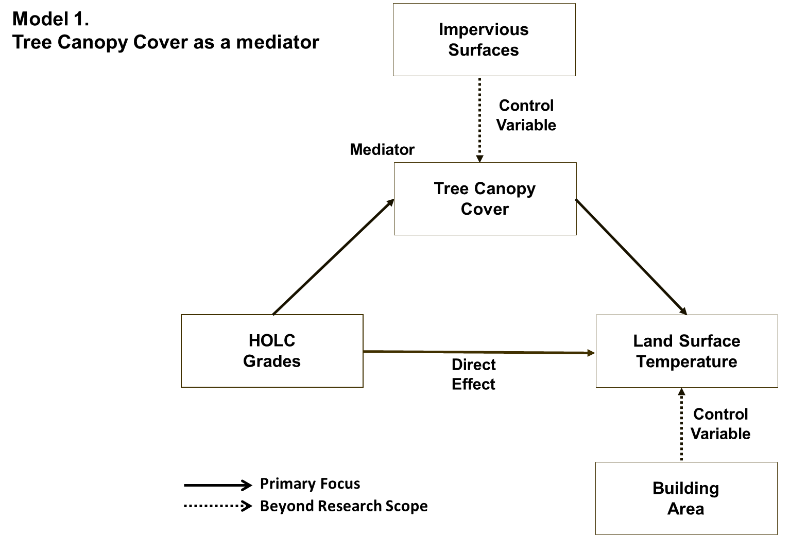

# Redlining_Temp

## Project Title
Unveiling the Legacy of Redlining: Pathways Linking HOLC Grades, Natural and Built Environments, and Land Surface Temperature

## Project Team
* Hoseok Sa 

## Project Overview
Numerous studies have examined the relationship between redlining policies, heat, and natural environments (or built environments). However, pathways contributing to heat vulnerability in historically redlined neighborhoods within a local context remain underexplored. **To address this gap, this project investigates how the legacy of redlining influences neighborhood land surface temperatures through natural and built environments using path (mediation) analysis, focusing on tree canopy cover and impervious surfaces.** Specifically, it employs geospatial analysis to assess land surface temperatures, natural environments, and built environments and utilizes statistical methods to explore their interrelationships.

## Background
**The Home Owners' Loan Corporation (HOLC)** created maps to classify neighborhoods into four grades: Grade A (green) was considered the most desirable, Grade B (blue) was still favorable, Grade C (yellow) was viewed as declining, and Grade D (red) was deemed the riskiest for investment. This practice, known as **redlining**, assessed neighborhoods based on demographics, infrastructure, housing quality, neighborhood stability, and proximity to amenities or hazards. However, these assessments were racially and ethnically discriminatory (Winling & Minchney, 2021). As a result, redlining has been recognized as a racially discriminatory government policy that denied people access to credit and housing based on their race. Aaronson et al. (2021) emphasized that redlining had lasting effects on the development of urban neighborhoods. Beyond its economic and social consequences, redlining has also contributed to long-term environmental and health disparities - with historically redlined neighborhoods being more vulnerable to extreme heat, natural disasters, and health risks due to systemic disinvestment and inadequate infrastructure (Nowak et al., 2022). 

## Problem Statement, Questions, and Objectives
Neighborhoods redlined in the 1930s and 1940s have experienced significantly higher heat exposure risks up to the present than neighborhoods not redlined. Several studies have explored the association between HOLC grades and the proportion of natural and built environments (i.e., tree canopy cover and impervious surfaces). However, existing studies have not thoroughly examined the mechanisms by which past redlining policies influence and mediate current heat exposure. The primary purpose of this study is to examine how the legacy of redlining affects neighborhood land surface temperature using path (mediation) analysis. Specifically, the study aims to answer the following research questions: **1) What is the relationship between the spatial patterns of tree canopies, impervious surfaces, and HOLC grades? Does this relationship remain consistent over time? 2) How are land surface temperatures in neighborhoods with different HOLC grades affected by the spatial distribution of tree canopies and impervious surfaces? 3) Are the mediating effects of the environmental factors on land surface temperature bigger than direct effect of HOLC grades on the land surface temperature?** 

## Study Area & Analysis Unit
* Study Area: Portland, especially focusing on HOLC boundaries in Portland. 
* Spatial Unit: HOLC-graded neighborhoods of the study area

  

## Datasets & URL
* **Landsat Collection 2 U.S. Analysis Ready Data (ARD) Level-2 Surface Temperature Science Project**[^1]: I calculated HOLC-graded neighborhoods' land surface temperature for 2021, 2017, and 2013, based on the data source. 
* **NLCD[^2] (National LandCover Database)**: The proportion of tree canopy cover and impervious surfaces was measured based on the dataset. 
* **Mapping Inequality[^3]**: It was used for HOLC-graded neighborhood boundaries.
* **American Community Survey Data[^4]**: Total population and housing units were derived from the NHGIS website.
* **Microsoft Building Footprints Data[5]**: This data source was used to calculate the building area and density around HOLC-graded neighborhoods. 

## Methodology/Approach
* Data Collection for Land Surface Temperature data
  * Less than 10% cloud cover above the city
  * No scan line errors present
  * No precipitation in the past 24-hour
  * Data will be captured from June to August for 2021, 2017, and 2013   
* Geospatial Analysis
  * Raster Analysis - Zonal Statistics/Merging Tiles/Clip/Reproject
  * Vector Analysis - Intersect  
* Statistical Analysis
  * Path Analysis (Mediation Effect Analysis)  

## Potential Tool/packages
* Loading data: rioxarray [^6]
* Zonal stat: rasterstats [^7]
* Raster clip: rasterio [^8]
* Raster reproject: rasterio 
* Intersect: geopandas [^9]

## Conceptual Framework
This study presents path analysis results based on the following conceptual frameworks. Since tree canopy cover and impervious surfaces are highly correlated, two separate models were developed to address multicollinearity concerns. The first framework focuses on **tree canopy cover**, incorporating two regression models: one estimating tree canopy cover proportion of HOLC-graded neighborhoods and the other estimating land surface temperature of HOLC-graded neighborhoods. Based on these regression results, this study assesses the mediating effect of tree canopy cover on the relationship between redlining grades and land surface temperature.

  

The second conceptual framework represents the conceptual model for **impervious surfaces**. This framework also incorporates two models: one estimating impervious surface proportion of HOLC-graded neighborhoods and the other estimating land surface temperature of HOLC-graded neighborhoods. Using these results, this research evaluates the mediating effect of impervious surfaces on the relationship between redlining grades and land surface temperature.
 

  

## Analysis Results

### Descriptive Results
* Neighborhoods with higher HOLC grades tend to have a more significant proportion of urban forests (or tree canopies) and a smaller proportion of impervious surfaces in each city, and this pattern has remained consistent over time.
* Neighborhoods with higher HOLC grades are less vulnerable to heat exposure, whereas those with lower grades are more susceptible. Additionally, neighborhoods with more urban forests and fewer impervious surfaces tend to have lower land surface temperatures.
* The mediating effect of urban forests on land surface temperatures is more substantial in cities with lower population density. In contrast, the mediating effect of impervious surfaces on land surface temperatures is weaker in cities with higher population density.

### Regression Results

## Discussion
* 

## Conclusion
* 

## References
* Aaronson, D., Hartley, D., & Mazumder, B. (2021). The Effects of the 1930s HOLC "Redlining" Maps. *American Economic Journal: Economic Policy*, 13(4), 355-392.
* Nowak, D. J., Ellis, A., & Greenfield, E. J. (2022). The disparity in tree cover and ecosystem service values among redlining classes in the United States. *Landscape and Urban Planning*, 221, 104370.
* Winling, L. C., & Michney, T. M. (2021). The roots of redlining: Academic, governmental, and professional networks in the making of the new deal lending regime. *Journal of American History*, 108(1), 42-69.

[^1]: https://earthengine.google.com/
[^2]: https://www.mrlc.gov/
[^3]: https://dsl.richmond.edu/panorama/redlining/data
[^4]: https://www.nhgis.org/
[^5]: https://github.com/microsoft/USBuildingFootprints
[^6]: https://corteva.github.io/rioxarray/stable/
[^7]: https://pythonhosted.org/rasterstats/
[^8]: https://rasterio.readthedocs.io/en/stable/
[^9]: https://geopandas.org/en/stable/
